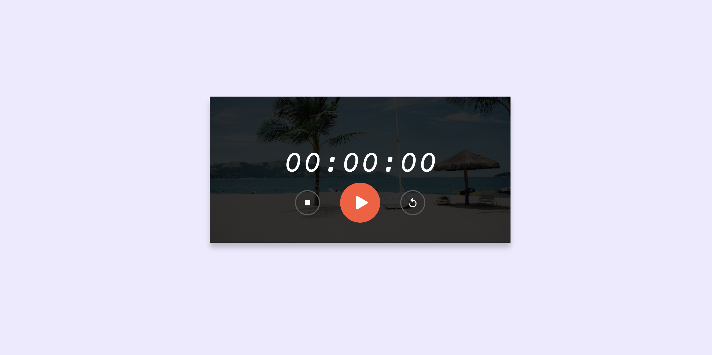

# ⏱️ Stopwatch Project

## Overview
This is a simple stopwatch application built using HTML, CSS, and JavaScript. The stopwatch allows users to start, stop, and reset the timer.

🖼️ **Screenshot:**  


## 🚀 Features
✅ Start, stop, and reset functionality  
✅ Displays elapsed time in hours, minutes, seconds, and milliseconds  
✅ User-friendly interface with responsive design  
✅ Lightweight and fast performance  
✅ Works on all modern browsers  

## 🛠 Technologies Used
🟢 **HTML**: Structure of the stopwatch UI  
🔵 **CSS**: Styling and layout  
🟡 **JavaScript**: Functionality and event handling  

## 🎮 How to Use
1️⃣ Open `index.html` in a web browser.  
2️⃣ Click the "▶ Start" button to begin timing.  
3️⃣ Click the "⏸ Stop" button to pause the timer.  
4️⃣ Click the "🔄 Reset" button to reset the stopwatch to 00:00:00.  

## 📁 Project Structure
```
/stopwatch-project
│── index.html   # Main HTML file
│── styles.css   # Styling for the stopwatch
│── script.js    # JavaScript logic
│── Images/dashboard.png  # Screenshot of the UI
```

## 📥 Installation
🛠 **Steps to Install:**
1. Clone the repository:
   ```sh
   git clone https://github.com/shelavalpallavi/stopwatch.git
   ```
2. Navigate to the project directory:
   ```sh
   cd stopwatch
   ```
3. Open `index.html` in your browser.


## 👩‍💻 Author
[Pallavi Shelavale]
